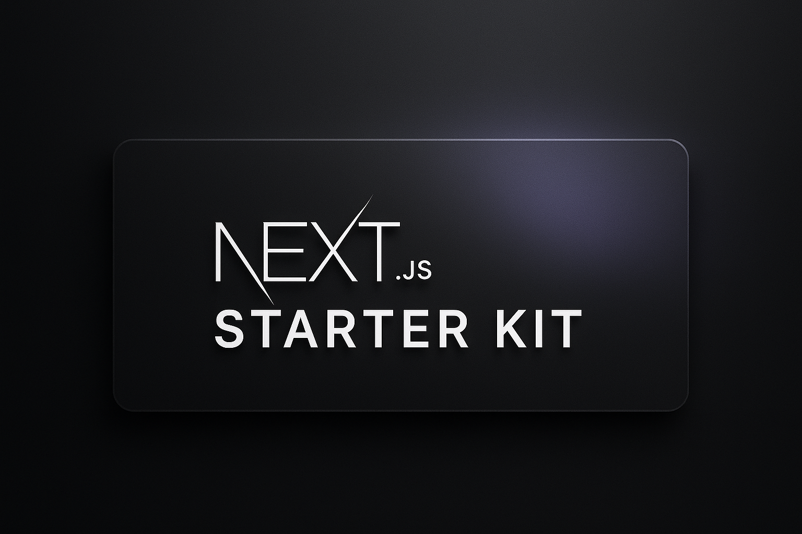

<h1 align="center">Next.js Starter Kit</h1>

<!-- Banner -->
<p align="center">
  
</p>

<p align="center">
  <a href="https://nextjs.org/"></a>
  <a href="https://tailwindcss.com/"></a>
  <a href="https://ui.shadcn.com/"></a>
  <a href="https://next-auth.js.org/"></a>
  <a href="https://www.prisma.io/"></a>
</p>

<p align="center">
  <b>The ideal starting point for SaaS and Micro-SaaS with Next.js.</b><br>
  Speed up your development with a modern, flexible, and production-ready kit.
</p>

---

## ✨ Key Features

- **Next.js 15+** with optimized settings
- **Shadcn UI**: Accessible and customizable UI components
- **Tailwind CSS**: Fast and responsive styling
- **NextAuth.js**: Production-ready authentication (OAuth, etc)
- **Prisma ORM**: Easy integration with SQL databases
- **TypeScript**: Strong and safe typing
- **Organized folder structure** to scale your project
- **Docker and Docker Compose configuration** for development and deployment
- **Ready for deployment** on Vercel, Netlify, Docker, and more

---

## 🤔 Why use this Starter Kit?

- **Save time:** Skip the initial setup and focus on your product features.
- **Best practices:** Modern architecture, strong typing, and popular tools.
- **Flexible:** Easily adapt for projects of any size.
- **Scalable:** Structure designed to grow with your SaaS.

---

## 🗂️ Project Structure

```
nextjs-starter-kit/
├── src/
│   ├── app/              # Next.js routes and pages
│   ├── components/       # Reusable components (UI, layout, etc)
│   ├── lib/              # Utilities and helpers
│   ├── server/           # Backend logic (auth, db)
│   └── styles/           # Global styles (Tailwind)
├── prisma/               # Prisma schema and migrations
├── public/               # Static files
├── .env.example          # Environment variables example
├── Dockerfile            # Docker configuration
├── docker-compose.yaml   # Container orchestration
└── ...
```

---

## 🚀 Getting Started

1. **Clone the repository:**
   ```bash
   git clone https://github.com/seu-usuario/nextjs-starter-kit.git
   cd nextjs-starter-kit
   ```

2. **Install dependencies:**
   ```bash
   npm install
   ```

3. **Set up environment variables:**
   - Copy `.env.example` to `.env` and fill in your credentials.

4. **Run the project in development:**
   ```bash
   npm run dev
   ```

5. **Access:** [http://localhost:3000](http://localhost:3000)

---

## 🤝 Contribute!

Want to suggest improvements, report bugs, or add new features? Feel free to open an [issue](https://github.comImGabreuw/nextjs-starter-kit/issues) or submit a [pull request](https://github.com/ImGabreuw/nextjs-starter-kit/pulls).

Join the community and help make this kit even better for everyone! 💙

---

## 📄 License

MIT License. See the [LICENSE](./LICENSE) file for more details.
